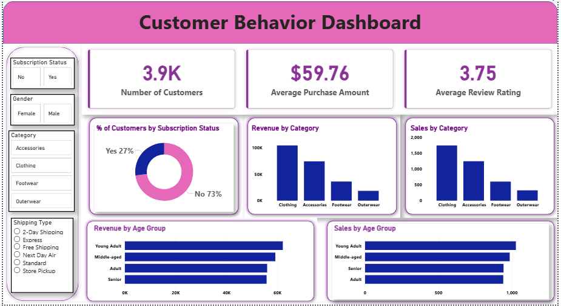

# Customer-Behavior-Data-Analyst-Portfolio-Project
This project represents a complete, industry standard, end-to-end data analytics workflow, The project cleans and enriches 3,900 transactions in Python, loads the result into a MySQL database, answers ten business questions with SQL, and visualizes the findings in a Power BI dashboard. Designed to mirror the real responsibilities of professional analysts in modern business environments. The project encompasses all critical stages of data analysis, from data preparation and modeling to insight generation, visualization, and reporting.


<p align="center">
  
</p>

---
## Table of Contents

- [Objectives](#objectives)
- [Tech Stack](#tech-stack)
- [Dataset](#dataset)
- [Workflow](#workflow)
- [Business Questions & Results](#business-questions--results)
- [Dashboard](#dashboard)
- [Key Insights](#key-insights)
- [Business Recommendations](#business-recommendations)
- [Project Structure](#project-structure)
- [Getting Started](#getting-started)
- [Known Limitations](#known-limitations)
- [Feedback](#if-you-found-this-project-useful)

---

## Objectives

- Clean and standardize a raw retail transactions dataset in pandas.
- Engineer features that support customer segmentation and trend analysis (age group, purchase frequency in days).
- Load the cleaned data into a MySQL database for SQL-based analysis.
- Answer ten business questions with SQL covering revenue, discounts, ratings, shipping, subscriptions, and customer segments.
- Present the findings in an interactive Power BI dashboard.

## Tech Stack

| Area | Tools |
| --- | --- |
| Language | Python 3 |
| Data handling | pandas |
| Database | MySQL, SQLAlchemy, PyMySQL |
| Environment | Jupyter Notebook |
| Dashboard | Power BI Desktop |

## Dataset

The source data is `customer_shopping_behavior.csv`, 3,900 rows and 18 columns of retail transactions.

| Group | Columns |
| --- | --- |
| Customer demographics | Age, Gender, Location, Subscription Status |
| Purchase details | Item Purchased, Category, Purchase Amount (USD), Season, Size, Color |
| Shopping behavior | Discount Applied, Promo Code Used, Previous Purchases, Frequency of Purchases, Review Rating, Shipping Type |

The Review Rating column had 37 missing values going in.

## Workflow

### 1. Data loading and exploration (`Customer_Shopping_Behavior_Analysis.ipynb`)
Loads the CSV with pandas and inspects it with `df.head()`, `df.info()`, and `df.describe(include='all')`.

### 2. Cleaning

| Step | Detail |
| --- | --- |
| Missing values | `Review Rating` imputed with the median rating of each product `Category` |
| Column names | Converted to snake_case (e.g. `Purchase Amount (USD)` → `purchase_amount`) |
| Redundant column | Confirmed `discount_applied` and `promo_code_used` were identical for every row, then dropped `promo_code_used` |

### 3. Feature engineering

| Feature | Logic |
| --- | --- |
| `age_group` | Customers split into four equal-sized quartiles by age: Young Adult, Adult, Middle-aged, Senior (`pd.qcut`) |
| `purchase_frequency_days` | `frequency_of_purchases` (Weekly, Monthly, etc.) mapped to an approximate number of days, e.g. Weekly → 7, Monthly → 30, Annually → 365 |

### 4. Load to MySQL
Connects to a local MySQL server with SQLAlchemy and PyMySQL, and writes the cleaned DataFrame to a `customer` table in the `customer_behavior` database with `df.to_sql(...)`.

### 5. SQL analysis (`customer_shopping_behavior_sql_queries.sql`)
Ten queries against the `customer` table answer the business questions below, run in MySQL Workbench.

### 6. Dashboard (`Customer_Shopping_Behavior_Dashboard.pbix`)
A Power BI report built on the same cleaned data, with filters for subscription status, gender, category, and shipping type.

## Business Questions & Results

| # | Question | Result |
| --- | --- | --- |
| 1 | Total revenue: male vs. female customers | Male: 157,890 · Female: 75,191 |
| 2 | Customers who used a discount but still spent above average | 839 customers |
| 3 | Top 5 products by average review rating | Gloves (3.86), Sandals (3.84), Boots (3.82), Hat (3.80), Skirt (3.78) |
| 4 | Average purchase amount: Standard vs. Express shipping | Standard: 58.46 · Express: 60.48 |
| 5 | Subscribers vs. non-subscribers: spend and revenue | Subscribers: 1,053 customers, 59.49 avg spend, 62,645 total · Non-subscribers: 2,847 customers, 59.87 avg spend, 170,436 total |
| 6 | Top 5 products by discount-purchase rate | Hat (50.00%), Sneakers (49.66%), Coat (49.07%), Sweater (48.17%), Pants (47.37%) |
| 7 | Customers segmented by purchase history | Loyal: 3,116 · Returning: 701 · New: 83 |
| 8 | Top 3 products per category | Accessories: Jewelry, Sunglasses, Belt · Clothing: Blouse, Pants, Shirt · Footwear: Sandals, Shoes, Sneakers · Outerwear: Jacket, Coat |
| 9 | Repeat buyers (5+ previous purchases) vs. subscription | Not subscribed: 2,518 · Subscribed: 958 |
| 10 | Revenue by age group | Young Adult: 62,143 · Middle-aged: 59,197 · Adult: 55,978 · Senior: 55,763 |

The full, runnable SQL for each question is in [`customer_shopping_behavior_sql_queries.sql`](customer_shopping_behavior_sql_queries.sql).

## Dashboard

The Power BI report gives a single view of the KPIs above, with slicers for Subscription Status, Gender, Category, and Shipping Type:

- **3.9K** customers, **$59.76** average purchase amount, **3.75** average review rating
- % of customers by subscription status (27% subscribed, 73% not)
- Revenue and sales by category
- Revenue and sales by age group

Open `Customer_Shopping_Behavior_Dashboard.pbix` in Power BI Desktop to explore it interactively.

## Key Insights

- **Male customers generate roughly twice the revenue of female customers** (157,890 vs. 75,191), despite the dataset being close to a 2:1 split in customer counts.
- **Discounts are common but not decisive.** 839 customers used a discount and still spent above average, and the products with the highest discount rates (Hat, Sneakers, Coat) are largely different from the top-rated products, so discounting doesn't appear to be propping up otherwise weak items.
- **Subscribers spend about the same per order as non-subscribers** (59.49 vs. 59.87 average), but subscribers make up only 27% of customers, so non-subscribers drive the large majority of total revenue.
- **Most customers are "Loyal"** (3,116 of 3,900, by the notebook's definition of more than 10 previous purchases), with very few "New" customers (83), suggesting the dataset skews toward an established customer base rather than new acquisition.
- **Repeat buyers lean toward not subscribing**: of customers with more than 5 previous purchases, 2,518 are not subscribed versus 958 who are, so loyalty and subscription status don't move together in this data.
- **Revenue is fairly even across age groups**, with Young Adults contributing the most (62,143) and Seniors the least (55,763), a gap of about 10%.

## Business Recommendations

- **Boost Subscriptions** – Promote exclusive benefits for subscribers.
- **Customer Loyalty Programs** – Reward repeat buyers to move them into the "Loyal" segment.
- **Review Discount Policy** – Balance sales boosts with margin control.
- **Product Positioning** – Highlight top-rated and best-selling products in campaigns.
- **Targeted Marketing** – Focus efforts on high-revenue age groups and express-shipping users.

## Project Structure

```
.
├── Customer_Shopping_Behavior_Analysis.ipynb   # Data cleaning, feature engineering, MySQL load
├── customer_shopping_behavior_sql_queries.sql  # 10 business-question queries
├── Customer_Shopping_Behavior_Dashboard.pbix   # Power BI dashboard
├── customer_shopping_behavior.csv              # Source data (not included — see note below)
├── Business Problem Document.pdf
├── Customer Shopping Behavior Analysis PDF.pdf # Report about project analysis
├── Customer Shopping Behavior Analysis PPT.pptx # PPT about project representation 
├── images/
│   └── dashboard_screenshot.png                # Dashboard preview for this README
├── requirements.txt
└── README.md
```

## Getting Started

### Prerequisites

- Python 3.9+
- Jupyter Notebook or JupyterLab
- MySQL Server 8+ and MySQL Workbench (or another SQL client)
- Power BI Desktop (Windows), to open the `.pbix` file

## Known Limitations

- **Hardcoded database credentials.** The notebook currently has a MySQL username and password typed directly into the connection cell. Before pushing this repository (or any fork of it) publicly, replace them with environment variables, as following:
  ```python
  import os
  username = os.environ["MYSQL_USER"]
  password = quote_plus(os.environ["MYSQL_PASSWORD"])
  ```
- Step 1: Install python-dotenv This is a small library that loads variables from a local .env file into your Python environment.If you're using a virtual environment, activate it first, then run that command.
  ```python
    !pip install python-dotenv
  ```
- Step 2: Create a .env file-In the same folder as your notebook, create a new file named exactly .env (no filename before the dot). Put your real credentials in it:
  ```python
  MYSQL_USER=root
  MYSQL_PASSWORD=password123
  ```
- Replace with this
  ```python
    import os
    from dotenv import load_dotenv
    # Load variables from .env into the environment
    load_dotenv()
    username = os.environ["MYSQL_USER"]
    password = quote_plus(os.environ["MYSQL_PASSWORD"])
  ```
## If You Found This Project Useful

### If this project helped you understand customer churn analysis, feel free to:

- ⭐ Star the repository
- 🍴 Fork the repository
- 💬 Share feedback
